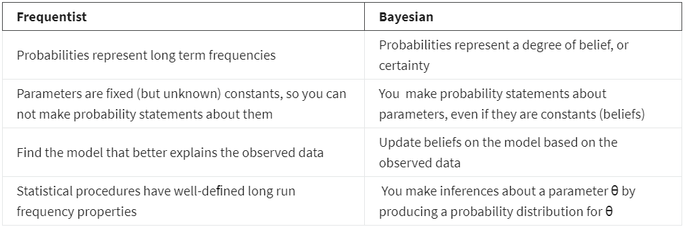
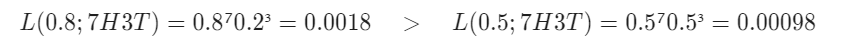
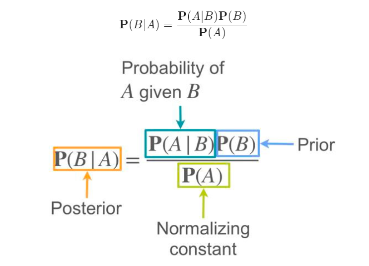
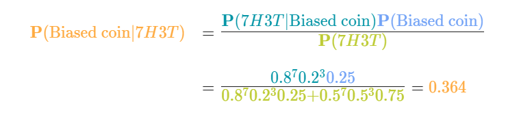
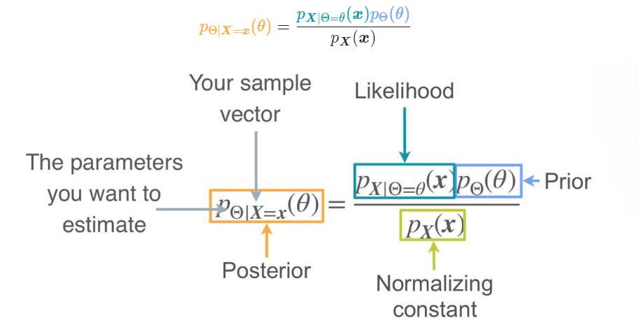
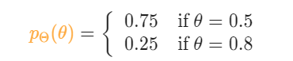
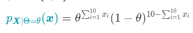
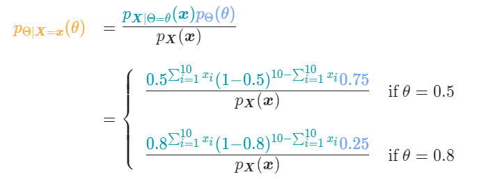
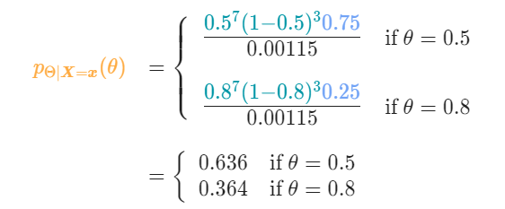

# Bayesian inference and MAP  

There are two approaches to statistical inference: Bayesian and Frequentist. The method of Maximum Likelihood you've seen so far falls in the Frequentist category. 

Let's see what some differences between the two approaches:  

  

The main difference between Frequentists and Bayesians is in the interpretation of probabilities. For Frequentists, probabilities represent long term relative frequencies, which is the  frequency of appearance of a certain event in infinite repetitions of the experiment. This implies that probabilities are objective properties of the real world and that the parameters of the distribution are fixed constants; you might not know their value but the value is fixed. Since probabilities represent long term frequencies, Frequentists interpret observed data as samples from an unknown distribution, so it is natural to estimate models in a way that they explain the sampled data as best as possible.

On the other hand, Bayesians interpret probabilities as a degree of belief. This belief applies to models as well. When you are Bayesian, even though you know the parameters take on a fixed value, you are interested on your beliefs on those values. Here is where the concept of prior is introduced. A prior is your baseline belief, what you believe about the parameter before you get new evidence or data. The goal of Bayesians is to update this belief as you gather new data. Your result will be an updated probability distribution for the parameter you are trying to infer. Using this distribution you can later obtain different point estimates.

Let's see how this works with a simple example. Imagine you have four coins, three of which are fair and one biased with a probability of heads of 0.8. You choose randomly one of the four coins, and you want to know if you chose the biased one. You flip the coin 10 times and get 7 heads. Which coin did you choose? 

A frequentist would say that you chose the biased one, because it has a higher likelihood:  

  

What would a Bayesian say? Notice that that the frequentist didn't take into account the fact that the biased coin had 1 in 4 chances of being picked at the beginning. A Bayesian will try to exploit that information, it will be their initial belief: without having any other information (observations) the chances of picking the biased coin is 1/4. The goal of a Bayesian is to update this belief, or probability, based on the observations. 

How do you actually perform this update? The answer lies in Bayes theorem. 

Remember from Week 1 of this course, that Bayes theorem states that given two events $A$ and $B$  
 
  

But how can you use this to update the beliefs?

Notice that if the event B represents the event that the parameter takes a particular value, and the event A represents your observations (7 heads and 3 tails), then $P(B)$ is your prior belief of how likely is that you chose the biased coin  before observing the data (0.25). $P(A | B)$ is the probability of your data given the particular value of the parameter (probability of seeing 7 heads followed by 3 tails given that the probability of heads is 0.8). Finally, $P(B|A)$ is the updated belief, which is called the posterior.  Note that $P(A)$ is simply a normalizing constant, so that the posterior is well defined. 

  

Look how you went from a 0.25 confidence of choosing the biased coin to 0.364. Note that while your beliefs of having chosen the biased coin have increased, this still isn't the most likely explanation. This is because you are taking into account the fact that originally your chances of choosing the biased coin were much smaller than choosing a fair one.   

## Formalizing Bayesian statistics  

In Bayesian statistics, the parameter you want to estimate is considered a random variable, and as such it has a probability distribution. This distribution will represent your beliefs on the parameters. 

In the previous example, you are actually trying to estimate the probability of heads, which can be either 0.5, if the coin is fair, or 0.8 is the coin is biased. Before seeing the coin flips, your belief was that $P(H) = 0.5$ with probability 0.75, and $P(H) = 0.8$ with probability 0.25. After the 10 coin flips, you updated your beliefs to favor a little bit more the biased coin than initially, so that: $P(H) = 0.5$ with probability 0.636, and $P(H) = 0.8$ with probability 0.364.  

Let's introduce some notation. We will use the Greek letter $\Theta$ (uppercase theta) to represent any parameters we want to estimate. For example, consider the distributions you learnt in Week 1, Lesson 2:  
- If the samples come from a population with a Bernoulli($\mathcal{p}$) distribution, then $\Theta = \mathcal{p} = P (\text{Success})$.  
- If the samples come from a  population  with a Gaussian($\mu, \sigma$) distribution, then, depending on your unknowns, you could have $\Theta = \mu$, $\Theta = \sigma$ or even the vector $\Theta = (\mu, \sigma)$.  
- If the samples come from a population with a  Uniform($0, b$) distribution, then $\Theta = b$.  

Now that both the parameters and the data are random variables, to update the posterior you will need the Bayes theorem formula for random variables, rather than events. You learnt about this in Week 2, Lesson 2, 'Conditional Distribution' video. 

There are five components in Bayesian statistics: 

- **Parameter** ($\Theta$): the parameter that you want to estimate. Note that we distinguish $\Theta$ the random variable representing the parameter, from $\theta$, a particular value that the parameter takes.  
- **Observed sample vector** ($x = (x_i, x_2, \dots, x_n)$): your vector of observations.  
- **Prior distribution**: it represents your initial beliefs on the parameter before having any samples. This tells about how you think the probabilities for $\Theta = \theta$ are distributed.  
- **Conditional distribution of the samples**: For each possible $\Theta = \theta$ you know the joint distribution of the samples. Since the observed values of the sample are fixed, this is turns out to be a function of $\theta$, so the condition distribution of the samples actually represents a likelihood!
- Posterior distribution: your updated beliefs on the parameter $\Theta$ after observing the data.  You will update them using the Bayes rules based on the observed data. 

There are four scenarios you need to consider, depending on the nature of each of the random variables:  
- $\Theta$ is a discrete random variable, and the data comes from a discrete distribution. 
- $\Theta$ is a continuous random variable, and the data comes from a discrete distribution.
- $\Theta$ is a discrete random variable, and the data comes from a continuous distribution.
- $\Theta$ is a continuous random variable, and the data comes from a continuous distribution.  

This will affect whether you need a probability mass function or a probability density function to describe the parameter and the data. Let's see how the posterior looks for each of these scenarios.

Discrete parameter, discrete data
This is the case you saw in the example you worked with earlier. In this case, both $\Theta$ and the data  will be described  by a probability mass function (PMF).  While considering a discrete distribution for the parameters isn't the most common in practice, it is always good to first understand the simplest case. 

In this case:  
- Prior distribution will be a PMF $(p_\Theta (\theta))$.  
- Conditional distribution of the samples: For each possible $\Theta = \theta$ your samples will be described by a conditional PMF $(p_{X|\Theta=\theta}(x))$.  
-  Posterior distribution: since $\Theta$ is still discrete, the posterior distribution will also be represented by the posterior PMF. 
Following Bayes rule you have that in general the posterior can be obtained as:  

  

Let's identify each of the five constitutive elements for the coin example  
- **Parameters:** $\Theta = P(H)$  
- Sample vector: If heads are represented by 1 and tails by 0, then $x = (1, 1, 1, 1, 1, 1, 1, 0, 0, 0)$  
- **Prior distribution:** here is where your initial beliefs come in.   
  
- **Conditional distribution of the samples:** Each sample comes from a Bernoulli distribution, so $p_{X|\Theta=\theta} (x) = \theta^x(1 - \theta)^{1-x}$, $x = \{0, 1\}$ so that the likelihood can be written as:  
   

Note that this is the same expression you got for the likelihood when looking for the MLE for a Bernoulli($p$) population. This is no coincidence, and is valid in general: whether you interpret the likelihood as coming from a joint distribution in the frequentist approach, or as coming from a  conditional joint distribution, as is the case in Bayesian statistics, the final expression for the likelihood is always the same.  
- **Posterior distribution:** Continuous parameter, discrete data  
  

Replacing for the observations, you get that $\sum_{i=1}^{10} x_i = 7$, and the denominator $p_X(x) = 0.00115$, so that  
  

While this is written formally as a PMF, it is the same result you got when applying Bayes theorem directly to the events.  

## Continuous parameter, discrete data  

Imagine now that instead of having four particular coins to choose from, you have just one coin but you have no idea what its probability of landing heads is. It could be any value between 0 and 1. In this case, you have infinite possible values for the parameter, so it makes sense to model it as a continuous random variable, so it will be described with a probability density function (PDF). The observations are the same, and data will still be represented by a PMF.

In general, when you have a parameter that is a continuous random variable, and data which is discrete, you get: